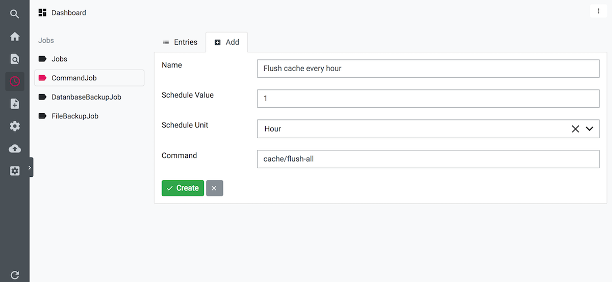

# Scheduler Module

## Installation

`composer require boehsermoe/luya-module-scheduler:"~1.0.0"`

In order to add the modules to your project go into the modules section of your config:

```php
return [
    'modules' => [
        // ...
        'scheduler' => [
            'class' => 'luya\scheduler\Module',
        ],
        // ...
    ],
];
```
```shell
docker-compose exec luya_php luya migrate
docker-compose exec luya_php luya import
```

Don`t forget to assign permission to user group for the scheduler module.

## Start jobs manuell via CLI

Start all expired jobs manual:
```shell
./luya scheduler/run
```

Execute specified job:
```
./luya scheduler/run/now {id/name of the job}
```

## Trigger jobs by cron

Start all expired jobs every minute via cron:
```shell
* * * * * ./luya scheduler/run
```

## Trigger jobs alternativ

### Via Webcron
Like [https://cron-job.org/de/](https://cron-job.org/de/) or [https://uptimerobot.com/](https://uptimerobot.com/). Or someother webcron service.

### Via yii application event


## CommandJob: Execute console commands

For example you can flush the cache every hour by add a new CommandJob (Scheduler -> CommandJobs -> Add) and insert "cache/flush-all" as command. The command is the route of the console command.




## Custom Jobs

You can also write your own jobs classes in the path "{appBasePath}/schedulers" or "{moduleBasePath}/schedulers". Every job have to inherite from BaseJob.

```php
class ExampleJob extends \luya\scheduler\models\BaseJob
{
    public function run()
    {
        // Do your job.
    }
}
```

A job with a text field as option could look like this:

```php
class ExampleTextJob extends \luya\scheduler\models\BaseJob
{
    public $text;

    public function rules()
    {
        return array_merge(parent::rules(), [
            [['text'], 'required']
        ]);
    }

    public function extraFields()
    {
        return [
            'text'
        ];
    }

    public function ngrestExtraAttributeTypes()
    {
        return [
            'text' => 'text',
        ];
    }

    public function run()
    {
        // Do your job
	//
	// echo $this->text;
    }
}
```

### More examples

For file backups: https://github.com/boehsermoe/luya-module-backup/blob/master/src/schedules/FileBackupJob.php

For database backups: https://github.com/boehsermoe/luya-module-backup/blob/master/src/schedules/DatanbaseBackupJob.php
